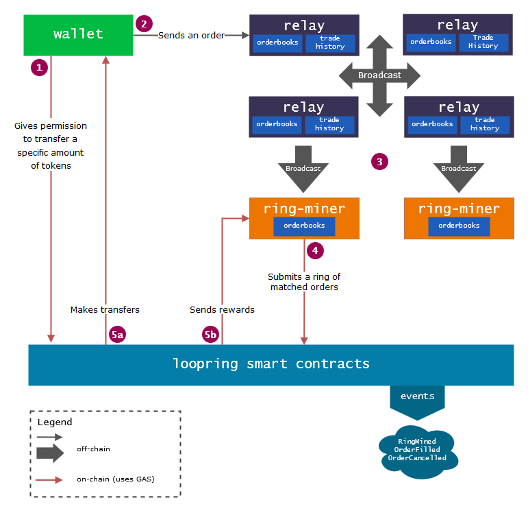
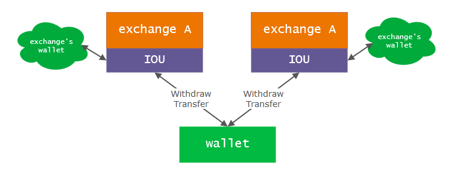

# What is Loopring

Loopring is a decentralized token exchange protocol. It is implemented as an ethereum smart-contract at the core of the loopring decentralized exchange system. Its design allows for several improvements over traditional centralized exchanges:

* **Zero Risks Trading:** The tokens stay in the user's wallet and are never locked by orders.
* **High liquidity:** Orders are ring-matched allowing for high liquidity on any trading pair.
* **Fairness:** The fee & discount model allows for fairness between all parties involved (Makers, Takers and Miners).
* **Weak Supervision:** The whole system is completely decentralised.

You can learn more about the background and general design of the loopring protocol in our [whitepaper](https://github.com/Loopring/whitepaper/raw/master/en_whitepaper.pdf).
Bear in mind that as we proceed with the implementation, some details in the whitepaper might become outdated. Whenever there is a difference, please refer to this website as the latest official update.

## Why ?
The loopring protocol was designed to address numerous issues found in centralized exchanges, for a brief explanation checkout the [last section](overview.md#issues-with-centralized-exchanges) of this page.

# Ecosystem

This section introduces the key parts of the loopring ecosystem and how they interact with each other. They jointly provide all functionalities a centralized exchange has to offer. For a more in depth explanation of each one of them, follow the links below.

**[Wallets](./projects/wallet.md)**
>A common wallet service/interface that gives you access to your tokens and provides you with a way to send orders to the loopring network.

**[Relays](./projects/relay.md)**
>Maintains public orderbooks and trade history. Broadcasts new orders to other relays and ring miners.

**[Ring Miners](./projects/ringminer.md)**
>Tries to determine a way to fulfill received orders by ring-matching them. This is computational heavy and is done completly off-chain. The process produces chains of trades involving at least 2 tokens, we call that an [order ring](./projects/protocol.md#order-ring).

**[Loopring Protocol Smart Contracts](./projects/protocol.md)**
>A set of smart contracts that checks ring-matched orders received from the miners, do the token transfers on behalf of the users, incentivize the miners and emit events. The relays/order browsers listen to these events to keep their orderbooks and trade history up to date.

**[Asset Tokenization Services](./projects/tokenization.md)**
> A bridge between assets that cannot be directly traded on loopring. They are centralized services ran by trustworthy companies or organisations. A user could deposit his assets (fiat or tokens from other chains) and get tokens issued. By returning the tokens the user get backs his deposit. LRC is not a cross-chain exchange protocol, but with Asset Tokenization Services, it is possible to trade Ethereum ERC20 tokens with physicial assets as well as assets on other blockchains.

> Asset Tokenization Services is not part of Loopring project though.

## Overview
This is the lifecycle of a successful order on the loopring network with an explanation of each step bellow.

**0 - The user wants to make a trade**
>The user wants to exchange `X` amount of `TokenA` for `Y` amount of `TokenB`. The current rate and orderbook for this pair can be found on multiple sources provided by the relays or any other interface hooked up on the network (e.g. orderbook browsers). Once he is ready, he uses his wallet interface to enter the details of his order and submits it. An amount of LRC can be added to the order as a fee for miners. Orders with a higher LRC fee have a better chance to be processed earlier by miners.

**1 - ERC20 Authorization**
>The wallet authorizes the loopring smart contracts to handle `X` amount of the `TokenA` the user wants to sell. This does not lock the user's tokens. He is free to move them while the order is being processed by the network. If the sender's balance is being checked at some point (by a miner or the loopring ) and the funds are insufficient, it will be considered scaled-down. A order being scaled-down is not the same as being cancelled, a scaled-down order will be automatically scaled up to its original size if funds sufficient are deposited to its address, while cancellation is a one way manual operation and cannot be revert.

**2 - Sending the order to the network**
>Once the authorization is made, the order's data is signed with the private key of the sender. Then, the wallet sends the order along with its signature to one or more nodes in the network (relay or ring-miner).

**3 - Broadcast**
>On the reception of the order, relays update their public orderbook and broadcast the order to other relays as well as ring miners to start the order processing as quickly as possible.

**4 - Ring Miners (order matching)**
>Ring Miners receive the order and add it to their orderbook. Each one of them tries to fill it fully or partially at the given exchange rate or better by ring-matching it with multiple other orders. The ring-matching is the main reason why the protocol is able to provide high liquidity over any pair. The details of the process are explained in the [Ring Miners](./projects/ringminer.md) page.
If the rate is better than the rate the user asked for, the savings are shared amongst all the orders in the ring and is called the Margin Split. For his fee the miner can choose between claiming the Margin Split and give back the LRC to the user or just keep the LRC fee.

**5 - Validation & Settlement**
>The ring is received by the loopring protocol contract. It makes multiple checks to verify the miner's supplied datas and determine if the ring can be settled fully or partially (depending on the fill rate of the orders in the ring and the tokens in the users wallets). If all checks are successful, the contract makes the token tranfers to the users (5a) and pays the miner's fees (5b) at the same time. This operation is atomic.

Some details were ommited to ease the understanding of what is happening when an order enters the loopring network. To deepen your understanding of the protocol (order cancelling, ring-matching, orderbooks and trade history synching, etc...) we advise you to take a look at the documentation of the key parts of the ecosystem [listed above](overview.md#ecosystem).

# Issues with centralized exchanges
To better understand the need of a system such as loopring, we first need to point the issues in the centralized exchanges model.

Here is a very simplified view of what happens when you send your tokens to a centralized exchange.

In order to use the exchange and trade your tokens, you first have to deposit your tokens in the exchange. Your tokens are sent to the exchange's wallets and it gives you back an IOU (I owe you), which is a proof of debt. Then you trade your IOU with other users IOUs. Finally when you want to withdraw, you give back your IOU to the exchange which then sends you back your tokens to your external wallet address.

**Lack of Security**
> In this model, you don't have control over your tokens. It allows for instant transactions on the exchange but it comes with a lot of risks. There are multiple scenarios where you could loose your money (frozen account, exchange shutting down, hacking, developer's mistakes, etc...).

**Lack of Transparency**
> Anything can happen to your tokens when they are on the exchange's wallets. You have no way of knowing what exactly. It is always too late when an exchange goes bankrupt and users never see it coming.

**Lack of Liquidity**
> You are only able to trade with the exchange own order pools and supported token pairs. If there is not enough volume you can try on an other exchange and if the token pair you want to trade is not supported, you could try making indirect trades with other pairs to get what you want or, again, transfer your funds to an other exchange. Either way you get hit multiple times by fees and you loose money.

There are other challenges faced by centralized exchanges. We won't discuss them all here and we advise you to read the many articles written on the subject across the web.